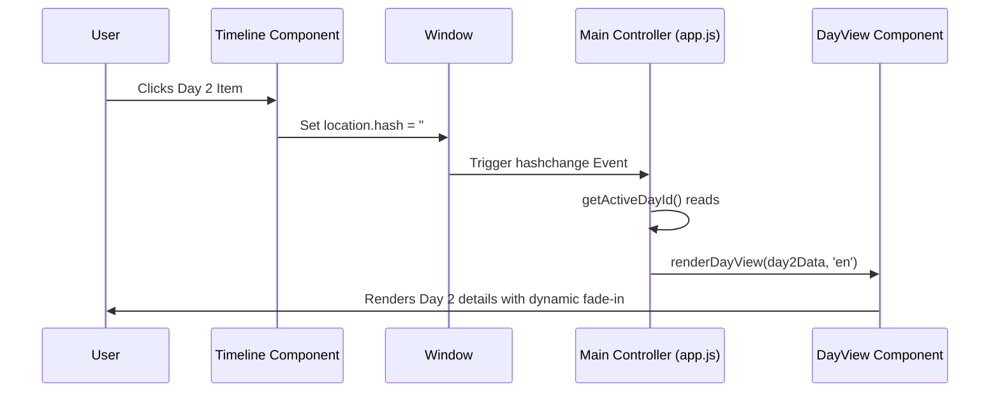

# Bergen & Olden Road Trip Planner - Project Architecture & Agent Guide

Welcome! This document provides a comprehensive description of the **Bergen & Olden Road Trip Planner 2026** codebase, its architecture, key implementation flows, and developer guidelines. It is designed to quickly onboard coding agents and developers.

---

## 1. Project Overview

The **Bergen & Olden Road Trip Planner** is an interactive, responsive single-page web application (SPA) acting as the dashboard/command center for a Norwegian fjord road trip (scheduled for July 23 – July 26, 2026).
Its primary objectives are:
1. **Interactive Itinerary Tracking:** Dynamic day-by-day lookup of trip details.
2. **Logistics & Analytics:**
   - Pre-trip planning checklist.
   - Daily driving intensity analysis (visualized as total daily kilometers, with fuel cost in EUR/NOK based on Norway-specific prices).
   - Flexible sightseeing routes with timing recommendations to avoid peak commuter traffic at ferry terminals.
3. **English-Only Interface:** Simplified and focused English-only UI.

---

## 2. Technical Stack

The application is built using lightweight, frontend-only technologies that require no server-side compilation, bundling, or dynamic pre-processing:
- **Core Structure:** HTML5 (semantic elements).
- **Style & Layout:** 
  - [Tailwind CSS](https://tailwindcss.com) (loaded via CDN) for responsive utility classes.
  - [Vanilla CSS](file:///Users/ftsarev/Documents/us_trip/bergen_trip/css/styles.css) for animations (`fadeIn`), custom scrollbars, timeline active states, and custom grid/connector graphics.
  - **Typography:** Google Fonts (`Playfair Display` for serif headers, `Inter` for clean sans-serif text).
- **Logic & Control:** Pure Vanilla JavaScript (ES modules) managing reactive state changes.
- **Analytics & Visualization:** [Chart.js](https://chartjs.org/) (loaded via CDN) for the driving distance chart.

---

## 3. Directory & File Map

The codebase is structured logically with a clean separation between data, layout, components, and controller:

```
bergen-trip-planner/
├── .agents/
│   └── AGENTS.md                   # This instruction and architecture guide
├── css/
│   └── styles.css                  # Custom styling rules, variables, animations
├── js/
│   ├── app.js                      # Main application orchestrator
│   ├── data.js                     # Centralized static trip data and planning checklist
│   ├── i18n.js                     # Localization utilities (English-only) & static UI dictionary
│   └── components/
│       ├── day-view.js             # Detailed daily sequence rendering module (with optional stay photo support)
│       ├── driving-chart.js        # Driving intensity Chart.js visualization (metric & EUR/NOK first)
│       ├── timeline.js             # Timeline navigation sidebar/header handler
│       └── todo-list.js            # Pre-trip checklist handler
├── index.html                      # Entry point structure & basic static layout
├── cabin.avif                      # User-provided image for the Flåten cabin lodging
└── .gitignore                      # Git exclusion rules
```

### File Profiles:
* **[index.html](file:///Users/ftsarev/Documents/us_trip/bergen_trip/index.html):** Declares layout structure, references scripts as ES modules (`type="module"`), imports CDNs, and defines localized elements using `data-i18n` attributes.
* **[css/styles.css](file:///Users/ftsarev/Documents/us_trip/bergen_trip/css/styles.css):** Sets base styles, custom colors (dark forest green `#556b2f`, off-white backgrounds `#fdfbf7`), transitions, and card hovers.
* **[js/app.js](file:///Users/ftsarev/Documents/us_trip/bergen_trip/js/app.js):** Coordinates routing logic and triggers component updates on interaction.
* **[js/data.js](file:///Users/ftsarev/Documents/us_trip/bergen_trip/js/data.js):** Houses the structured dataset `tripData` (single-source with English strings) and `todos` checklist state.
* **[js/i18n.js](file:///Users/ftsarev/Documents/us_trip/bergen_trip/js/i18n.js):** Provides a simplified translation resolver utility and the English UI translation dictionary.
* **[js/components/timeline.js](file:///Users/ftsarev/Documents/us_trip/bergen_trip/js/components/timeline.js):** Renders the horizontal (mobile) / vertical (desktop) timeline items. Handles selection callback and scrolling behaviors.
* **[js/components/day-view.js](file:///Users/ftsarev/Documents/us_trip/bergen_trip/js/components/day-view.js):** Transforms structured data steps (`drive`, `activity`, `stay`, `travel`) into dynamic, styled HTML templates. Supports displaying photos in lodging/stay cards using `step.image` property.
* **[js/components/todo-list.js](file:///Users/ftsarev/Documents/us_trip/bergen_trip/js/components/todo-list.js):** Renders planning tasks and listens to user completion clicks.
* **[js/components/driving-chart.js](file:///Users/ftsarev/Documents/us_trip/bergen_trip/js/components/driving-chart.js):** Maps trip data driving distances and redraws the daily mileage chart using a canvas tag. Displays driving load in kilometers and fuel cost estimates in EUR and NOK.

---

## 4. Key Architectural Flows

### A. Initialization Flow
When a user loads the page, the application executes the following bootstrap sequence inside [js/app.js](file:///Users/ftsarev/Documents/us_trip/bergen_trip/js/app.js):
1. Wait for `DOMContentLoaded`.
2. Instantiate and render the pre-trip checklist via `initTodoList`.
3. Invoke `updateLanguage('en')` to initialize translation strings, compile the timeline sidebar, render the day itinerary corresponding to the active URL hash, and construct the driving intensity chart.
4. Attach a listener to the `hashchange` window event to handle path routing.

### B. Routing and Hash State
The application avoids full-page reloads and state loss by using URL hashes as routes:
- Each day's detailed view corresponds to `#day-{id}` (e.g. `#day-2`).
- Selection changes on the timeline trigger:
  ```javascript
  window.location.hash = `day-${dayId}`;
  ```
- A `hashchange` listener captures this change, reads the active ID, searches for the corresponding object in `tripData`, and calls `renderDayView` to perform a smooth fade-in draw of that day's itinerary list.
- If the hash is invalid or missing, it defaults to Day 1.



### C. Day View Template Rendering
[js/components/day-view.js](file:///Users/ftsarev/Documents/us_trip/bergen_trip/js/components/day-view.js) is a parser that dynamically evaluates the `sequence` array of a day. It uses an HTML-generation engine switching on the event `type`:
- **`drive`:** Embeds a Google Maps route iframe and outputs travel distances, duration, and specific traffic timing recommendations.
- **`stay`:** Renders lodging checkpoints, showing a custom side photo if `step.image` is provided (e.g. `cabin.avif`).
- **`activity`:** Renders key locations/events marked by customized emoji icons.
- **`travel`:** Renders main flights or long transits with custom time badges.
- **Alert Blocks:** Formats descriptions matching warning patterns (containing `⚠️`) and isolates warnings inside highlighted callout modules.

---

## 5. Development Guidelines & Constraints

When writing code or adding features to this workspace, please adhere to the following rules:

### 1. English-Only UI
- Keep all text contents and translations English-only. Do not introduce language switchers or multi-language objects unless requested.

### 2. Preserve Semantic HTML Structure
- Use HTML5 semantic elements correctly (e.g. `<main>` for layout contents, `<nav>` for menus, `<section>` for logical modules, `<header>` and `<footer>`).
- Ensure all interactive elements have descriptive IDs and classes for ease of browser automation, accessibility, and style injection.

### 3. Responsive Styling Guidelines
- Maintain Tailwind utility configurations carefully. When adjusting grid setups (e.g., in the timeline list, sequence-container, or analytics layout), always test on both mobile, tablet, and desktop breakpoints.
- Custom aesthetic properties (such as `.step-connector` sizes or `.hike-tile` widths) must be updated inside [css/styles.css](file:///Users/ftsarev/Documents/us_trip/bergen_trip/css/styles.css) with appropriate CSS `@media` overrides.

### 4. Code Standards & Imports
- Use ES Module syntax exclusively (`import` / `export`). Do not mix CommonJS modules or introduce external bundlers unless explicitly instructed.
- Keep components focused and isolated under `js/components/`. State adjustments should be driven back to the parent module (`js/app.js`) or managed through clean return handles.
- **Chart.js Management:** When updating data, always ensure the previous Chart.js instance is properly destroyed (`chartInstance.destroy()`) before creating a new one to prevent memory leaks and overlapping canvas layers.

---

## 6. Verification and Review

Before finalizing changes, developers and agents should verify that:
- The website loads correctly without any JS console errors.
- Changing timeline selections updates the URL hash and updates details smoothly.
- CSS media queries handle both horizontal mobile layouts and vertical desktop tracks correctly.
